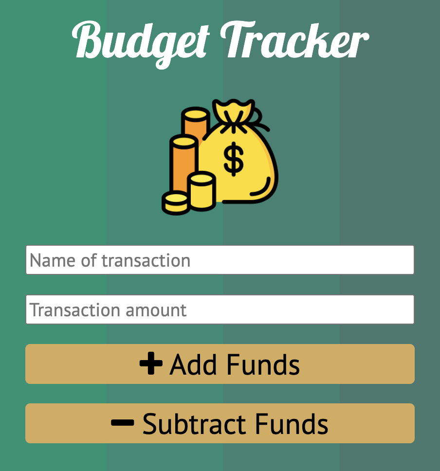
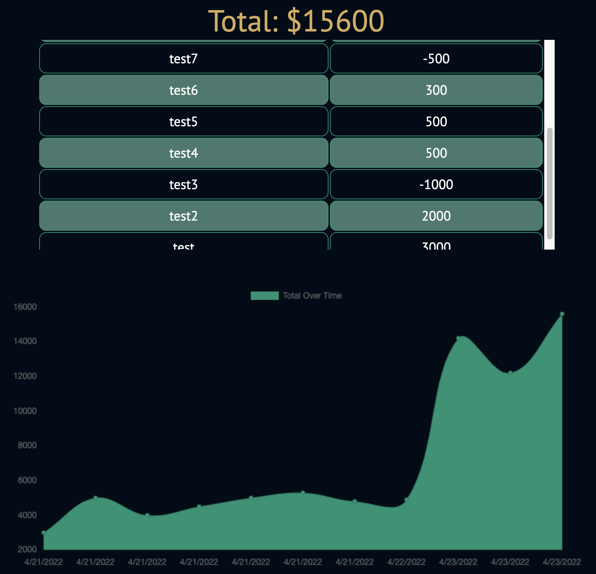

# Budget Tracker 
Progressive web application where users can download a budget tracker and add or remove expenses.

 

<b>

[CLICK HERE TO VIEW THE WEBPAGE LIVE](https://hidden-caverns-61141.herokuapp.com/)

</b>

 
   
  
  
 

 

## Technologies

* HTML
* CSS
* JavaScript
* Chart.js
* Node.js
* Express.js
* Mongodb Atlas
* Mongoose ODM
* IndexedDB
* Service Worker API
* Heroku

